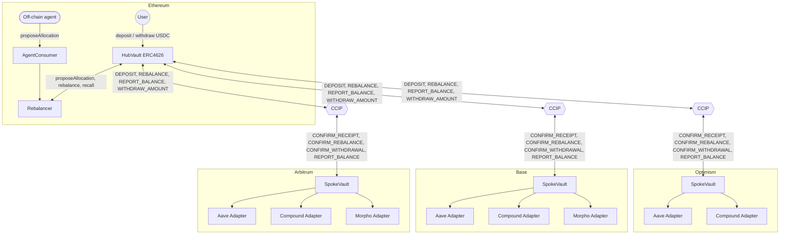

# Meridian

Meridian is a cross-chain USDC yield vault. Users deposit into an ERC4626 vault on Ethereum (the hub); capital is deployed into Aave, Compound, and Morpho across three L2s (the spokes) via Chainlink CCIP. Spokes are not directly accessible to users, who hold a single share token representing proportional value across every chain and market in which the protocol is deployed.

Status: testnet, unaudited. This is a capability demonstration, not a production deployment. Every figure and guarantee stated below should be verified against the code; none constitutes a promise.

## Design highlights

- **A three-path asynchronous withdrawal engine with claim-time pricing.** Withdrawals settle immediately when idle balance and spoke freshness permit; otherwise, the payout is computed at settlement rather than at request time. See [docs/withdrawals.md](docs/withdrawals.md).
- **A failure-first CCIP design.** Every inbound message handler assumes that a partner adapter may revert, a confirm may fail to send, and a transit leg may fail to arrive. No component assumes successful delivery. See [docs/resilience.md](docs/resilience.md).
- **A spoke report sanity band with a quarantine circuit breaker.** A spoke report exceeding the configured ceiling is quarantined rather than applied; the vault pauses new deposits and withdrawal requests until the owner resolves the quarantine. See [docs/security.md](docs/security.md).
- **Collision-free message identity.** Message identifiers are derived from a monotonic nonce rather than from message content, precluding collision between operations in the same block. See [docs/resilience.md](docs/resilience.md).
- **A storage-preserving module split.** The Hub and Spoke contracts were each refactored from a single monolithic contract into a storage base and sibling logic modules; storage layout was verified unchanged before and after the refactor. See [docs/architecture.md](docs/architecture.md).
- **An invariant and regression test suite.** Invariant fuzzing, slot-pinned regression tests that detect storage layout drift, and a mainnet-fork integration suite. See [docs/development.md](docs/development.md).

## Architecture


<!-- verified: CCIPHelpers.sol:MessageType for the message names on each edge; HubMessagingModule.sol and SpokeHandlersModule.sol for direction; src/adapters/ for the three adapter contracts; strategy.js:MARKETS.optimism.protocols for Optimism lacking Morpho -->

The hub is the single accounting authority. It contains no strategy logic; it tracks idle USDC, in-transit USDC, and each spoke's last reported balance. Spokes are execution arms: they hold no user-facing accounting and execute instructions received from the hub, reporting balances in return. See [docs/architecture.md](docs/architecture.md) for the rationale behind this topology.

## Repository map

| Path | Description |
|---|---|
| `src/hub/` | Hub storage base plus the three sibling modules (admin, messaging, withdrawal) that make up `HUB` |
| `src/spoke/` | Spoke storage base plus the three sibling modules (admin, handlers, confirms) that make up `SpokeVault` |
| `src/libraries/` | `CCIPHelpers` (message codec) and `AllocationMaths` (pure allocation validation math) |
| `src/adapters/` | Aave, Compound, and Morpho adapters, one `IYieldSource` implementation each |
| `src/Rebalancer.sol`, `src/AgentConsumer.sol` | Off-chain agent entry point and on-chain allocation guardrails |
| `script/` | Deployment scripts, testnet and fork simulation |
| `test/units/` | Per-function unit tests |
| `test/regression/` | One test file per fix campaign item (WI-1 through WI-7, FX-1 through FX-8), named after the issue it locks in |
| `test/invariants/` | Foundry invariant fuzzing over Hub and Spoke handlers |
| `test/integration/` | Multi-contract flows, including the mainnet-fork end-to-end test |
| `docs/` | This documentation set, plus `docs/reference/` (generated API reference) and `docs/layout/` (storage layout snapshots from the module split) |

## Quickstart

```bash
git clone --recurse-submodules <repo-url>
cd meridian
forge build
forge test
```

If the repository is cloned without `--recurse-submodules`, submodules must be initialized before building: `git submodule update --init --recursive`.

The full suite runs without any network access except one test, `test/integration/FullFlowTest.t.sol`, which forks live Ethereum and Arbitrum mainnet state and requires `ETH_RPC_URL` and `ARBITRUM_RPC_URL`. Absent those variables, that test fails at `setUp()`; every other test still passes. <!-- verified: FullFlowTest.t.sol:setUp, vm.envString("ETH_RPC_URL") -->

```bash
export ETH_RPC_URL=https://your-mainnet-rpc
export ARBITRUM_RPC_URL=https://your-arbitrum-rpc
forge test --match-contract FullFlowTest -vvv
```

Deployment scripts are in `script/`: `DeployTestnet.s.sol` for the live testnet deployment listed below, `DeployForkSimulation.s.sol` for local fork-based rehearsal. See [docs/development.md](docs/development.md) for the complete build, test, and deploy procedure.

## Documentation

| Doc | Scope |
|---|---|
| [docs/index.md](docs/index.md) | One-screen map of this documentation set and suggested reading order by audience |
| [docs/architecture.md](docs/architecture.md) | System topology, module layout, message protocol, fund location model |
| [docs/withdrawals.md](docs/withdrawals.md) | The three-path withdrawal engine, claim-time pricing, multi-leg recalls, cancellation |
| [docs/resilience.md](docs/resilience.md) | Failure handling: message non-delivery, duplication, delayed arrival, and falsified spoke reports |
| [docs/security.md](docs/security.md) | Trust model, roles, invariants, known limitations, audit status |
| [docs/design-decisions.md](docs/design-decisions.md) | Design rationale: alternatives considered, rejected, and superseded, reorganized from the original design log |
| [docs/development.md](docs/development.md) | Build, test taxonomy, storage layout snapshots, module conventions for contributors |
| [docs/operations.md](docs/operations.md) | Operational runbook: in-transit reconciliation and confirm retry procedures |
| [docs/revert-audit.md](docs/revert-audit.md) | Systematic review of revert paths underlying the defensive receiver pattern |
| [docs/reference/](docs/reference/) | Generated API reference (forge doc output), regenerated from NatSpec, not hand-edited |
| [docs/docs-findings.md](docs/docs-findings.md) | Discrepancies identified between code and documented behavior during preparation of this documentation set, flagged for review and not remediated here |

## Testnet deployments

Addresses below reflect the most recent deployment recorded in `broadcast/DeployTestnet.s.sol/`. Only the Aave adapter is deployed on any spoke; Compound and Morpho adapters exist in source but have not been deployed to testnet. <!-- verified: broadcast/DeployTestnet.s.sol/*/run-latest.json, cross-checked against every timestamped run file per chain for the most recent CREATE per contract -->

| Chain | Contract | Address |
|---|---|---|
| Ethereum Sepolia | HUB | `0xff30cb7dced182eb4b4424e88f4347077a097b37` |
| Ethereum Sepolia | Rebalancer | `0x76f9547b8bd1f77bfe988535a559321a657e7acd` |
| Ethereum Sepolia | AgentConsumer | `0xe0a30a4ea672023277d80f3dbf752aa6faedd37e` |
| Arbitrum Sepolia | SpokeVault | `0x7871dd7e4826123c9f4f18565d9f874132ec2348` |
| Arbitrum Sepolia | AaveAdapter | `0x22e1a6ed534d015f8ef51238ee43c10b754b321c` |
| Base Sepolia | SpokeVault | `0xc69dddb4e33d0cef7a08ac171f877e1e1018b107` |
| Base Sepolia | AaveAdapter | `0x458a708cb6b4bf8ea21e9089f195fad2ab61ef05` |
| Optimism Sepolia | SpokeVault | `0x2a835c21fce662a0d88b1abe91bfbace5675a025` |

These addresses reflect repeated redeployments during development and may not represent the current state. `broadcast/DeployTestnet.s.sol/` is the source of truth; this table is a convenience snapshot.

## Disclaimer

Meridian is unaudited software deployed on testnet only. This documentation does not constitute financial advice. The protocol should not hold mainnet funds prior to an independent security review. See [docs/security.md](docs/security.md) for a complete list of known limitations.
