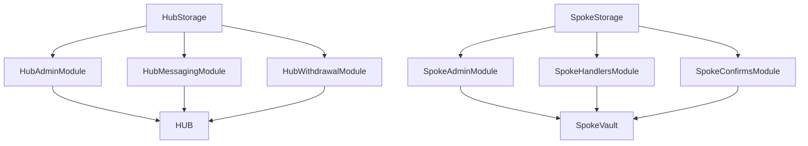

# Architecture

This document specifies the system topology: the rationale for the hub-and-spoke split, the organization of the Hub and Spoke contracts into modules, the message protocol between them, the fund location model, and share accounting. It is intended for readers seeking to understand how the components interact before examining any single mechanism in depth. Protocol evaluation begins here, following the README; protocol integration continues from here into [docs/withdrawals.md](withdrawals.md) and [docs/security.md](security.md).

## Terminology

The following terms are used consistently throughout this documentation set.

- **Idle.** USDC held by the hub or a spoke that is neither in CCIP transit nor deployed into a yield adapter.
- **In-transit.** USDC that has been dispatched via CCIP and not yet confirmed as arrived at its destination.
- **Recall leg.** One `WITHDRAW_AMOUNT` dispatch to a single spoke, issued as part of a multi-spoke withdrawal recall plan. See [docs/withdrawals.md](withdrawals.md).
- **Settlement.** The point at which a queued withdrawal is finalized: shares are burned and USDC is transferred to the receiver. See [docs/withdrawals.md](withdrawals.md).
- **Quotation.** The `previewRedeem(shares)` value computed at withdrawal request time. A sizing reference for recall planning, not a guaranteed payout. See [docs/withdrawals.md](withdrawals.md).
- **Quarantine.** The state entered by a spoke report that exceeds the sanity band described below. The balance is held pending owner review rather than applied. See [docs/security.md](security.md).
- **Reconciliation.** Owner-gated recovery of a specific in-transit deposit leg's tracked amount, invoked via `reconcileTransit` once the leg is provably unrecoverable. See [docs/resilience.md](resilience.md).

## Hub and spoke topology

An alternative design would deploy one contract per chain, each independently tracking its own share price, with users selecting a deposit chain. Meridian does not use this design. The protocol maintains exactly one accounting authority, the hub on Ethereum; every other chain is an execution arm with no user-facing accounting of its own.

Yield opportunities across chains change over time: a given market's rate on one L2 varies month to month, and the highest available rate in the system may shift to a different chain. Under a per-chain share price, capturing a shift would require a user to withdraw from one chain's vault and deposit into another's, incurring gas, slippage, and CCIP latency on each rebalance, with the decision left to the user. Centralized accounting on the hub allows capital to move between chains and markets without user-facing action, equivalent from the user's perspective to a single-chain vault reallocating between two lending markets. A spoke receives instructions and holds capital; it does not make allocation decisions.

Spoke logic is correspondingly minimal. A `SpokeVault` does not evaluate the rationale for a `DEPOSIT`, compare rates, or decide whether to rebalance; it executes the instruction received and reports the resulting state. Allocation decisions, which markets, what amounts, and when to move capital, are made off-chain by the agent and validated on-chain by the `Rebalancer`, one layer above the hub.

## Module layout

The `HUB` and `SpokeVault` contracts were originally implemented as single files. Each is now a composition of a storage base and three sibling logic modules; storage layout, external selectors, and gas cost were verified unchanged across the split for every function. <!-- verified: docs/layout/hub.json, docs/layout/hub-selectors.json, docs/layout/spoke.json, docs/layout/spoke-selectors.json, the pre/post split snapshots -->

<!-- verified: src/hub/HubStorage.sol, src/hub/HubAdminModule.sol, src/hub/HubMessagingModule.sol, src/hub/HubWithdrawalModule.sol, src/Hub.sol; src/spoke/SpokeStorage.sol, src/spoke/SpokeAdminModule.sol, src/spoke/SpokeHandlersModule.sol, src/spoke/SpokeConfirmsModule.sol, src/Spoke.sol -->

Every struct, state variable, and event resides in the storage base (`HubStorage` or `SpokeStorage`) in its original declaration order. This preserves storage layout across the split: Solidity assigns storage slots by declaration order across the inheritance chain, and a single contract owning every declaration, inherited directly by every module, precludes any module from altering slot assignment. `HUB` and `SpokeVault` consist of a constructor that forwards arguments to the storage base, together with a small number of override-resolution stubs required by Solidity's multiple-inheritance rules when more than one sibling module touches the same base class function. These stubs perform pure delegation and contain no independent logic.

Because the three sibling modules do not inherit one another, a function in one module occasionally requires access to a function defined in another. Solidity does not provide visibility into a sibling contract's members unless declared in a shared ancestor. This is addressed with a hook pattern: the storage base declares a bodiless `virtual` function, exactly one module implements it with `override`, and any module requiring access to it does so through the inherited declaration. `HubStorage` declares seven such hooks (`isValidSpoke`, `_idleBalance`, `_allSpokesFresh`, `_newMessageId`, `_requestAllBalanceReports`, the three-argument overload of `recallFromSpoke`, and `attemptSettlement`); `SpokeStorage` declares two (`_aggregatedSpokeBalance`, `_sendOrQueueConfirm`). <!-- verified: src/hub/HubStorage.sol Cross-Module Hooks section, src/spoke/SpokeStorage.sol Cross-Module Hooks section -->

## Message protocol

All hub-spoke communication uses a single struct, `CCIPHelpers.CcipMessage`, ABI-encoded into the CCIP `data` field. A `MessageType` enum determines the handler to which the receiver routes the message. <!-- verified: CCIPHelpers.sol:CcipMessage, CCIPHelpers.sol:MessageType -->

| Direction | Type | Carries tokens | Sent by | Handled by |
|---|---|---|---|---|
| Hub to spoke | `DEPOSIT` | Yes | `sendToSpoke`, Rebalancer-only | `_handleDeposit` |
| Hub to spoke | `REBALANCE` | No | `rebalance`, Rebalancer-only | `_handleRebalance` |
| Hub to spoke | `REPORT_BALANCE` (request) | No | `_requestAllBalanceReports`, Path 2 withdrawal or manual | `_reportBalance` |
| Hub to spoke | `WITHDRAW_AMOUNT` | No | `recallFromSpoke`, both overloads | `_handleWithdrawalWithAmount` |
| Spoke to hub | `CONFIRM_RECEIPT` | No | after `_handleDeposit` finishes | `_handleDepositCallback` |
| Spoke to hub | `CONFIRM_REBALANCE` | No | after `_handleRebalance` finishes | `_handleRebalanceCallback` |
| Spoke to hub | `REPORT_BALANCE` (response) | No | after `_reportBalance` runs | `_handleReportBalanceCallback` |
| Spoke to hub | `CONFIRM_WITHDRAWAL` | Yes, if any pulled | after `_handleWithdrawalWithAmount` finishes | `_handleWithdrawalCallback` |
<!-- verified: HubMessagingModule.sol:sendToSpoke, HubMessagingModule.sol:rebalance, HubMessagingModule.sol:_requestAllBalanceReports, HubMessagingModule.sol:recallFromSpoke, SpokeHandlersModule.sol:_handleDeposit, SpokeHandlersModule.sol:_handleRebalance, SpokeHandlersModule.sol:_reportBalance, SpokeHandlersModule.sol:_handleWithdrawalWithAmount, HubMessagingModule.sol:_handleDepositCallback, HubMessagingModule.sol:_handleRebalanceCallback, HubMessagingModule.sol:_handleReportBalanceCallback, HubMessagingModule.sol:_handleWithdrawalCallback -->

`REPORT_BALANCE` is a single enum value used in both directions; a request from the hub and a response from a spoke share the same message type and are distinguished only by direction. Every spoke-to-hub message carries `spokeBalance` and `reportTimestamp`, so any interaction with a spoke refreshes the hub's view of that spoke, whether or not it was prompted by an explicit balance request.

### Token delivery ordering

On a Programmable Token Transfer, the CCIP router delivers attached tokens to the receiving contract before invoking `_ccipReceive`. By the time `_handleDeposit` executes, the USDC balance is already held by the spoke. The handler does not pull funds from any source; it approves an adapter and calls `deposit`. <!-- verified: SpokeHandlersModule.sol:_handleDeposit, no token pull, only forceApprove + adapter.deposit -->

The same ordering applies in reverse for `CONFIRM_WITHDRAWAL`: tokens returned by the spoke are already held by CCIP by the time the hub's callback executes. The hub reads the delivered amount from `destTokenAmounts`, the CCIP token envelope, and does not use the amount claimed in the message payload. Hub accounting therefore remains correct regardless of payload accuracy: the amount applied is the amount CCIP delivered, not the amount described in the struct. <!-- verified: HubMessagingModule.sol:_handleWithdrawalCallback, uint256 actualAmount = destTokenAmounts.length > 0 ? destTokenAmounts[0].amount : 0 -->

## Fund location model

At any moment, USDC held by the protocol occupies exactly one of seven locations:

1. Idle on the hub, not yet sent anywhere
2. In CCIP transit, hub to spoke (`DEPOSIT` in flight)
3. Idle on a spoke, received but not yet deployed into an adapter (partial deposit skips, recall shortfalls, or direct transfers)
4. Deployed in that spoke's Aave adapter
5. Deployed in that spoke's Compound adapter
6. Deployed in that spoke's Morpho adapter
7. In CCIP transit, spoke to hub (`CONFIRM_WITHDRAWAL` funds in flight back)

The hub does not track these seven locations individually. It tracks three quantities: its own idle balance, `inTransitAssets` (location 2), and one `spokeBalances[selector]` per spoke, aggregating locations 3 through 6 for that chain as self-reported by the spoke. Location 7 has no dedicated hub-side counter; it remains counted within the prior `spokeBalances[selector]` value until the `CONFIRM_WITHDRAWAL` arrives and the hub applies the spoke's updated report, which no longer includes the departed funds. <!-- verified: HubWithdrawalModule.sol:totalManagedAssets, HubStorage.sol:inTransitAssets, HubStorage.sol:spokeBalances -->

The accounting identity `totalAssets() == idle + inTransitAssets + sum(spokeBalances)` holds at every point, because each transition between locations is paired with the corresponding counter update within the same transaction:

- A `DEPOSIT` sent by the hub decreases idle and increases `inTransitAssets` by an equal amount; the total is unchanged. <!-- verified: HubMessagingModule.sol:_sendToSpoke, inTransitAssets += totalAmount inside the same function that dispatches the CCIP send -->
- On arrival of `CONFIRM_RECEIPT`, `inTransitAssets` decreases by the exact amount tracked for that message id, and `spokeBalances[selector]` is set to the spoke's updated report, which reflects the arrived amount adjusted for any yield or loss accrued during transit. The total reflects this updated state. <!-- verified: HubMessagingModule.sol:_handleDepositCallback -->
- A `WITHDRAW_AMOUNT` sent by the hub does not move any hub-side counter; the funds remain counted within `spokeBalances[selector]` until they are actually withdrawn from the spoke. <!-- verified: HubMessagingModule.sol:_sendToSpoke, WITHDRAW_AMOUNT carries no tokens outbound -->
- On arrival of `CONFIRM_WITHDRAWAL`, idle increases by the amount actually delivered (via `safeTransfer` within settlement, or the raw balance increase from the incoming token transfer), and `spokeBalances[selector]` is set to the spoke's updated, lower report. The total is unchanged; value has moved between locations. <!-- verified: HubMessagingModule.sol:_handleWithdrawalCallback -->

A validation layer governs application of self-reported balances. Every arriving `spokeBalance` passes through `_applyReportedBalance`, which checks the value against an upside-only sanity band before writing to `spokeBalances`. A report exceeding the band is quarantined rather than applied. See [docs/security.md](security.md) for the band specification; the accounting identity above assumes a report that passed this check.

## Share accounting

The hub is a standard OpenZeppelin ERC4626 vault. `totalAssets()` returns the sum defined by the fund location model above, `idle + inTransitAssets + sum(spokeBalances)`, so share price reflects managed value across the protocol, including yield accrued on a spoke and value in CCIP transit. Only the internal hooks `_deposit` and `_withdraw` are overridden; the public entry points `deposit`, `mint`, `withdraw`, and `redeem` are unmodified, consistent with OpenZeppelin's guidance against overriding the public-facing pair directly. <!-- verified: HubWithdrawalModule.sol:totalAssets, HubWithdrawalModule.sol:_deposit, HubWithdrawalModule.sol:_withdraw -->

`_deposit` adds no logic beyond the standard mint (USDC in, shares out at the current share price), gated by `whenNotPaused`. `_withdraw` is fully overridden with no call to `super`, because the standard ERC4626 `_withdraw` burns shares and transfers assets within a single call, and Meridian's withdrawal engine cannot always perform both operations immediately. See [docs/withdrawals.md](withdrawals.md) for the mechanism.

### Worked example: a first deposit

A freshly deployed hub has no depositors and no registered spokes. Alice deposits 1,000 USDC.

- Before: `totalSupply() == 0`, `totalAssets() == 0`.
- Alice calls `deposit(1000e6, alice)`. `previewDeposit` computes shares as `assets * (totalSupply() + 1) / (totalAssets() + 1)` (the vault applies no decimals offset); for an empty vault this yields `1000e6 * 1 / 1 = 1000e6` shares. <!-- verified: lib/openzeppelin-contracts/contracts/token/ERC20/extensions/ERC4626.sol:_convertToShares, no _decimalsOffset override in HubStorage.sol -->
- `_deposit` executes: USDC transfers from Alice to the hub, and 1,000e6 shares mint to Alice.
- After: idle on the hub is 1,000e6, `inTransitAssets` is 0, no spoke holds a balance, and `totalAssets() == 1,000e6`. Alice holds all 1,000e6 shares, valued at 1,000e6 USDC, a 1:1 price consistent with the first deposit into an empty vault.

The USDC has not moved off Ethereum. It remains idle on the hub until the Rebalancer, acting on an allocation proposal from the off-chain agent, calls `sendToSpoke`. Deposits and allocation are decoupled by design: a user deposit does not block on CCIP latency.

## Related documents

[docs/withdrawals.md](withdrawals.md) specifies the withdrawal side of the ERC4626 surface, the three-path engine handling settlement when it cannot occur synchronously. [docs/resilience.md](resilience.md) specifies protocol behavior when a CCIP message described above does not arrive as assumed.
