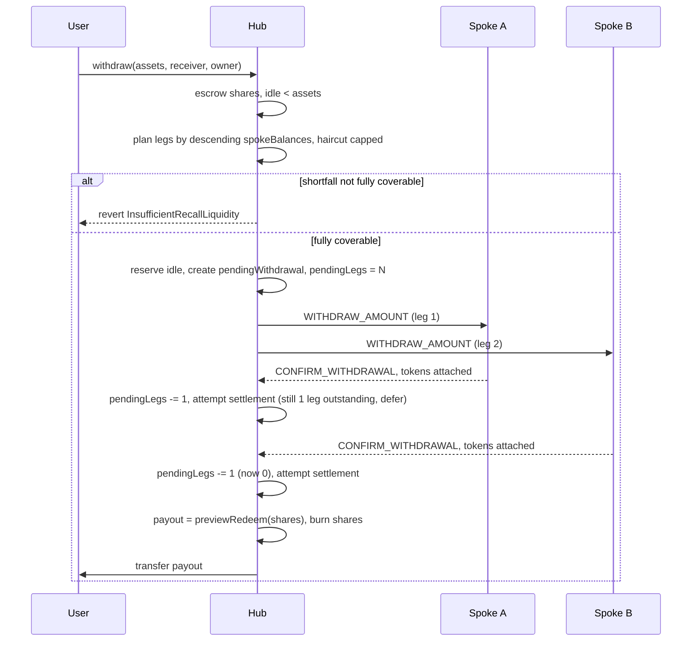

# Withdrawals

This document specifies the withdrawal engine in full: path selection, settlement pricing, multi-leg recall, arrival handling, and cancellation. Familiarity with [docs/architecture.md](architecture.md) is assumed, including the definitions of `totalAssets`, `spokeBalances`, and `inTransitAssets`.

## Withdrawal path selection

Every withdrawal begins identically: shares move from the withdrawer to the hub contract, escrowed rather than burned. The hub then selects one of three paths based on two conditions: whether hub idle covers the requested amount, and, if so, whether all active spokes' balance reports are fresh. <!-- verified: HubWithdrawalModule.sol:_withdraw, _transfer(owner, address(this), shares) happens before any path branches -->

- **Path 1, synchronous.** Idle covers the amount, and every active spoke reported within the last `MAX_STALENESS` (1 hour). Settlement occurs in the same transaction as the request; no entry is created.
- **Path 2, asynchronous on staleness.** Idle covers the amount, but at least one spoke's report is stale. The hub queues the withdrawal and requests a fresh `REPORT_BALANCE` from every active spoke. Settlement occurs once every spoke has reported fresh, determined by whichever report arrives last.
- **Path 3, asynchronous on insufficient idle.** Idle alone does not cover the request. The hub plans a set of recall legs across active spokes, dispatches `WITHDRAW_AMOUNT` to each, and settles once all legs have arrived.

<!-- verified: HubWithdrawalModule.sol:_withdraw, the idleFree >= assets branch for Path 1/2 vs the fall-through to Path 3 planning -->

<!-- verified: HubWithdrawalModule.sol:_withdraw (Path 3 planning and dispatch), HubMessagingModule.sol:_handleWithdrawalCallback (leg arrival), HubWithdrawalModule.sol:_attemptSettleWithdrawal (the pendingLegs == 0 gate) -->

## Quotation and settlement pricing

When a withdrawal is queued (Path 2 or Path 3), the hub records a `quotedAssets` value, `previewRedeem(shares)` computed at request time. This value is a sizing reference for the recall, not a guaranteed payout. The amount paid is `previewRedeem(shares)` recomputed at settlement, which may occur minutes later. <!-- verified: HubWithdrawalModule.sol:_withdraw, PendingWithdrawal.quotedAssets set at request time; HubWithdrawalModule.sol:_attemptSettleWithdrawal, uint256 payout = previewRedeem(entry.shares) recomputed at settlement -->

Under a fixed request-time quote, any share price movement during the queuing interval, from a spoke loss or yield report or another user's Path 3 recall, would be borne entirely by other shareholders rather than the queued withdrawer, creating an arbitrage opportunity against the gap between quote and settlement. Claim-time pricing ensures the withdrawer's payout tracks the same share price as all other shareholders until the moment of settlement.

Example. Bob requests a Path 2 withdrawal for 500 shares when `totalAssets() = 10,000e6` and `totalSupply() = 10,000e6` shares, a 1:1 price, giving `quotedAssets = 500e6`. While the hub awaits stale spoke reports, one spoke reports a loss, reducing `totalAssets()` to `9,500e6` with `totalSupply()` unchanged at `10,000e6`. When the final fresh report arrives and `_attemptSettleWithdrawal` executes, `previewRedeem(500e6 shares)` computes to `500e6 * 9,500e6 / 10,000e6 = 475e6`. Bob receives 475e6. `WithdrawalRepriced` is emitted alongside `WithdrawalProcessed` whenever the settlement amount differs from the quotation. <!-- verified: HubWithdrawalModule.sol:_attemptSettleWithdrawal, emit WithdrawalRepriced(id, entry.quotedAssets, payout) fires only if payout != entry.quotedAssets -->

## Multi-leg recall planning

Path 3 does not recall from a single spoke. It sorts active spokes by descending reported balance and plans legs against them in that order until the shortfall is fully covered. <!-- verified: HubWithdrawalModule.sol:_spokesByDescendingBalance -->

Each leg is capped below the spoke's full reported balance, at `(spokeBalance * (10,000 - RECALL_HAIRCUT_BPS)) / 10,000`. `RECALL_HAIRCUT_BPS` is 50, half a percent. <!-- verified: HubStorage.sol:RECALL_HAIRCUT_BPS = 50 -->  The haircut accounts for a spoke's reported balance being up to `MAX_STALENESS` old at the time a recall is planned. Requesting a spoke's full self-reported balance risks the recall falling short if the actual balance decreased since the report, from market fluctuation or an operation not yet reflected in the hub's view. The margin of half a percent against a report up to one hour old bounds this risk.

Planning executes as a dry run. Before any state change or CCIP dispatch, the hub walks the same sorted list and sums the amount coverable under the haircut cap. If the shortfall cannot be fully planned across every active spoke, the call reverts with `InsufficientRecallLiquidity`; no shares are escrowed and no funds are locked. Only once the dry run confirms full coverage does the hub commit: reserving idle, writing the `pendingWithdrawal` entry with the final leg count, and dispatching. <!-- verified: HubWithdrawalModule.sol:_withdraw, the two-pass structure, first loop computes remaining and legCount without touching state, second loop (after the InsufficientRecallLiquidity check) actually reserves and dispatches -->

## Recall leg arrival

On arrival of a recall leg's `CONFIRM_WITHDRAWAL`, the hub does not use the message payload's claimed amount. It reads `destTokenAmounts`, the token envelope delivered by CCIP, and applies that value to the pending withdrawal's `arrivedAssets` and to the hub's internal ledger of funds sent to that spoke. The payload's claimed amount is not used for accounting. <!-- verified: HubMessagingModule.sol:_handleWithdrawalCallback, uint256 actualAmount = destTokenAmounts.length > 0 ? destTokenAmounts[0].amount : 0 -->

Each leg arrival is one settlement attempt for the pending withdrawal rather than a guaranteed settlement. `pendingLegs` decrements and settlement is attempted; settlement remains gated (see below) and may still defer after the final leg arrives, if idle solvency is insufficient at that time.

## Settlement gate placement

`attemptSettlement` is a permissionless external function callable by any address to advance a pending withdrawal. This permits CCIP callback handlers to trigger settlement via `try`/`catch` without a settlement failure affecting a token-carrying CCIP execution, and permits any party to advance a stalled withdrawal. A permissionless settlement entry point also permits circumvention of path gating: calling it immediately after a Path 2 withdrawal is queued, before any fresh report has landed, would settle at the stale price that motivated queuing.

Every gate, freshness for Path 2, `pendingLegs == 0` for Path 3, solvency for both, is enforced inside `_attemptSettleWithdrawal` rather than at its call sites. The same checks apply regardless of caller: the permissionless `attemptSettlement`, a CCIP callback, or any other entry point. Classification of an entry as Path 2 or Path 3 requires no separate flag; it is derived from stored state, an entry with `pendingLegs > 0 || arrivedAssets > 0` was routed through Path 3, all other entries are Path 2. <!-- verified: HubWithdrawalModule.sol:_attemptSettleWithdrawal, bool isPathThreeEntry = entry.pendingLegs > 0 || entry.arrivedAssets > 0 -->

Solvency is checked last and scoped to the individual entry: idle currently claimable by this entry alone, total idle minus the reservations of every other pending entry, must cover the payout. Settlement of one entry does not draw against another withdrawer's reservation. <!-- verified: HubWithdrawalModule.sol:_attemptSettleWithdrawal, uint256 reservedByOthers = reservedAssets - entry.reservedIdle -->

## Deferral and recovery

If any gate fails, `_attemptSettleWithdrawal` does not revert; it emits `SettlementDeferred` and returns. A revert at this point would affect the token-carrying CCIP execution from which this function is often called, since funds have already been delivered by the time the callback runs. The entry remains pending. <!-- verified: HubWithdrawalModule.sol:_attemptSettleWithdrawal, three separate emit SettlementDeferred / return pairs, no revert path -->

Recovery of a deferred entry depends on the deferral cause. A Path 2 entry deferred on freshness is retried at the next spoke report, since every report re-checks `_allSpokesFresh()` and retries settlement automatically. A Path 3 entry deferred on outstanding legs is retried as each leg arrives. An entry deferred solely on solvency, all other gates satisfied but idle temporarily insufficient, requires a subsequent trigger: a later leg arrival, a report arrival, or a direct call to `attemptSettlement`.

## Cancellation

`cancelWithdrawal` provides recovery when no deferral trigger above resolves the entry within a reasonable interval, for example a spoke that stops reporting entirely, or a recall leg that never arrives. After `WITHDRAWAL_TIMEOUT` (24 hours) has elapsed since the request, the owner of the pending withdrawal, and only that owner, may cancel it without owner or admin intervention. <!-- verified: HubStorage.sol:WITHDRAWAL_TIMEOUT = 24 hours, HubWithdrawalModule.sol:cancelWithdrawal -->

Cancellation releases the reservation and returns the escrowed shares. It does not reclaim any leg that arrived before cancellation; those funds are already ordinary hub idle, and the returned shares represent a proportional claim on that idle. If a leg arrives after cancellation, the arrival callback resolves the `legToWithdrawal` lookup correctly, since that mapping is never deleted, but finds `pendingWithdrawals[id].shares == 0` and routes the funds to the orphaned-arrival path, emitting `OrphanedRecallArrival` and crediting the tokens as ordinary idle. No additional handling is required for this case; the existing live-entry check at the callback site covers it. <!-- verified: HubWithdrawalModule.sol:cancelWithdrawal, HubMessagingModule.sol:_handleWithdrawalCallback, the pendingWithdrawals[wid].shares > 0 branch vs the else emitting OrphanedRecallArrival -->

## User-facing consequences

**`redeem` and `withdraw` both route through settlement pricing.** Meridian's `_withdraw` override ignores the `assets` argument and recomputes `previewRedeem(shares)` internally, regardless of whether the call originated from `withdraw(assets, ...)` or `redeem(shares, ...)`. A call to `withdraw` first converts the requested assets to shares via `previewWithdraw` (rounding up) at the ERC4626 level, after which Meridian's override converts those shares back to assets via `previewRedeem` (rounding down). Within a single block, absent price movement, this round trip yields a result within rounding tolerance of the requested amount. Across a Path 2 or Path 3 delay, the result may differ according to price movement during that interval, as in the example above. Requested amounts are quotations. Settled amounts are computed at settlement time. <!-- verified: HubWithdrawalModule.sol:_withdraw, assets = previewRedeem(shares) overwrites the incoming parameter unconditionally; lib/openzeppelin-contracts ERC4626.sol:withdraw and :redeem both funnel into the same _withdraw -->

**Expected latency by path.** Path 1 settles within the request transaction. Path 2 settlement latency is bounded by the slowest of every active spoke's response to a `REPORT_BALANCE` request, one CCIP round trip per spoke, typically on the order of tens of minutes depending on spoke count and CCIP conditions. Path 3 settlement latency is bounded by the slowest of the dispatched recall legs, each an independent CCIP round trip. Neither path has a hard upper bound; the 24 hour cancellation timeout is the applicable worst-case bound.

[docs/operations.md](operations.md) specifies UI guidance following from the redeem/withdraw distinction above: interfaces should default to `redeem(shares)` over `withdraw(assets)`, since `shares` is the exact quantity burned regardless of price movement, whereas `assets` is a request-time conversion only.
